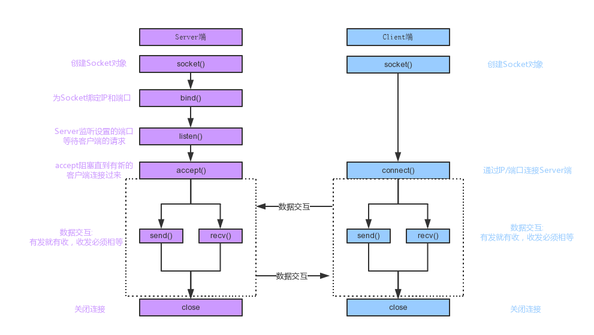

## python知识点

### 一、数据类型
    1、字符串
        json:什么是字符串
        json.loads() json字符串转换成字典
        json.dumps() 字典转换成字符串
        
    2、列表与元组
        服务端ip和端口号不希望通过接口修改，可以使用元组
        元组可重复
        列表可动态修改
        
    3、字典类型
    4、集合
        定义：{1, 2, 3}
        用途：去重；关系测试：交集、并集
        
### 函数与对象方法
    1、函数多种形参类型——通用性就是能用参数就用参数传递（标志位法flag）
        必填、缺省、可变args、关键字kwargs
        
    2、函数返回值
        return
        
    3装饰器
        函数高级用法
        
### 面向对象技术
    1、类的定义
    
    2、实例方法、对象方法、类方法
    
    3、继承：业务扩展，比如vip用户扩展到svip
    
    4、多态:子类/父类的重写
    
### 常用库——标准库
    
|名称|作用|
|---|---|
|datetime|为日期和时间处理同时提供了简单和复杂的方法|
|zlib|直接支持通用的数据打包和压缩格式:zlib,gzip,bz2,zipfile,tarfile|
|random|提供生成随机数的工具|
|math|为浮点运算提供了对底层C函数库的访问|
|sys|工具脚本经常调用命令参数，这些命令行参数以链表形式sys模块的argv变量|
|glob|提供了一个函数用于从目录通配符搜索中生成文件列表|
|os|提供了不少与操作系统相关的函数|

### 常用的库——第三方库
|名称|作用|
|---|---|
|Twisted|对于网络应用开发者最重要的工具|
|SymPy|可以做代数评测、差异化、扩展、复数等|
|SQLAlchemy|数据库的库|
|SciPy|python的算法和数学工具库|
|Scapy|数据包探测和分析库|
|pywin32|提供和windows交互的方法和类的Python库|
|pyQT|python的GUI工具，给Python脚本开发用户界面时次于wxPython的选择|
|pyGtk|也是Python的GUI库|
|Pyglet|3D动画和游戏开发引擎|
|Pygame|开发2D游戏的时候会有很好的效果|

### 工具设计需求
    功能：输入一个ip地址，获取对应机器开放的端口
    版本：1.0
    技术点：socket网络编程技术、多线程技术
    扩展需求：待跟进
    
### 软件开发架构
    1、应用类：C/S
    2、web类：B/S
    
    C/S即：Client和Server：客户端与服务器端架构，这种架构也是从用户层面
    （也可以是物理层面）来划分的
    这里的客户端一般泛指客户端应用程序EXE，程序需要先安装在后，才能运行在
    用户的电脑上，对用户的电脑操作系统环境依赖较大
    
    3、网络通信要素
        IP地址：互联网协议地址
        端口：可以认为是设备与外界通讯交流的出口
        ip地址精确到具体的一台电脑，而端口精确到具体的程序
        传输协议：七层协议
        
    4、通信协议
        一个完整的计算机系统是由硬件、操作系统、应用软件三者组成
        互联网的核心就是由一堆协议组成，协议就是标准，比如全世界
        人通信的标准是英语，如果把机器比作人，互联网协议就是计算
        机界的英语，所有的计算机都学会了互联网协议，那所有的计算
        机就都可以按照统一的标准去收发信息从而完成通信
        
## Socket网络编程
    
### Socket概念
    Socket是应用层与TCP/IP协议族通信的中间软件抽象层，它是一组接口
    在设计模式中，Socket其实就是一个门面模式，它把复杂的TCP/IP协议
    族隐藏在Socke接口后面，对于用户来说一组简单的接口就是全部,让Socket
    去组织数据，以符合指定的协议
    
    TCP协议：可靠的，面向连接的协议，（例如：打电话）、传输效率低，全
    双功通信（发送缓存&接收缓存）、面向字节流。使用TCP的应用:Web浏览
    器、电子邮件、文件传输程序等
    
    UDP协议：不可靠的，无连接的服务，传输效率高（发送前时延小），一对
    一、一对多、多对一、多对多、面向报文、尽最大努力服务，无拥塞控制。
    使用UDP的应用：域名系统（DNS）、视频流、IP语音（VoIP）,反正数据
    给你了，不管有没有拿到
    

    

### 什么是socket编程

    Socket又称“套接字”，应用程序通常通过套接字向网络发出请求或者应答网络请求
    使主机间或者一台计算机上的进程可以通讯
    具体更多内容查看python仓库中的内容
    
### socket编程思路
    服务端：
    
    创建套接字，绑定套接字到本地IP与端口：socket.socket(socket.AF_INET,socket.SOCK_STREAM) , s.bind()
    开始监听连接：s.listen()
    进入循环，不断接受客户端的连接请求：s.accept()
    接收传来的数据，或者发送数据给对方：s.recv() , s.sendall()
    传输完毕后，关闭套接字：s.close()
    
    客户端：
    
    创建套接字，连接服务器地址：socket.socket(socket.AF_INET,socket.SOCK_STREAM) , s.connect()
    连接后发送数据和接收数据：s.sendall(), s.recv()
    传输完毕后，关闭套接字：s.close()

    服务器和客户端一对一实例如下
    
```python
# coding=utf-8
# 文件名：socket_server.py

import socket


ip_port = ('127.0.0.1', 9999)
sk = socket.socket()  # 创建套接字对象
sk.bind(ip_port)    # 绑定服务地址
sk.listen(5)    # 监听连接请求

print('启动socket服务，等待来自客户端的信息...')
conn, address = sk.accept()     # 等待连接，此处自动阻塞
while True:     # 一个死循环，直到客户输入'exit'才关闭连接
    client_data = conn.recv(1024).decode()  # 解码接收信息
    print('来自%s的客服端信息:%s' % (address, client_data))

    if client_data == 'exit':
        break
    send_data = input('请输入发送到客户端数据:')
    conn.sendall(send_data.encode())    # 回馈信息给客户端
conn.close()    # 关闭连接
```

```python
# coding=utf-8
# 文件名：socket_client.py

import socket


ip_port = ('127.0.0.1', 9999)
sk = socket.socket()    # 创建套接字对象
sk.connect(ip_port)     # 连接服务器

while True:     # 通过一个死循环不断接收用户信息，并发送给服务器
    info = input('输入要发送到服务端的信息:')
    sk.sendall(info.encode())
    if info == 'exit':
        break

    server_data = sk.recv(1024).decode()
    print(server_data)
sk.close()
```
    控制台先运行：socket_server.py文件，再运行socket_client.py文件且输入信息发送到服务器
    然后socket_server.py控制台中也可输入信息反馈给客户端
    
    
    实现并发处理多个客户端请求的socket服务端
    
```python
# coding=utf-8
# 文件名 test_socket_server.py

import socketserver

# 继承类：BaseRequestHandler
class TestSocketServer(socketserver.BaseRequestHandler):

    def handle(self):
        conn = self.request     # request封装了所有请求数据
        while True:
            client_data = conn.recv(1024).decode()
            print('接收客户端传信息%s' % client_data)
            if client_data == 'exit':
                break

            info = input('服务端发送数据:')
            conn.sendall(info.encode())

if __name__ == '__main__':
    # 创建一个多线程TCP服务器
    test = socketserver.ThreadingTCPServer(('127.0.0.1', 9999), TestSocketServer)
    print('---socket服务启动了---')
    # 启动服务器，服务器一直保持运行状态
    test.serve_forever()
```

```python
# coding=utf-8
# 文件名：socket_clientA.py

# 客户端依然使用socket模块
import socket


ip_port = ('127.0.0.1', 9999)
sk = socket.socket()
sk.connect(ip_port)

while True:
    send_info = 'A:' + input('请输入>>>:')
    sk.sendall(send_info.encode())
    if send_info == 'exit':
        break

    server_data = sk.recv(1024).decode()
    print('接收服务端返回的信息是:%s' % server_data)
sk.close()
```

```python
# coding=utf-8
# 文件名：socket_clientB.py

import socket


ip_port = ('127.0.0.1', 9999)
sk = socket.socket()
sk.connect(ip_port)

while True:
    send_info = 'B' + input('请输入>>>:')
    sk.sendall(send_info.encode())
    if send_info == 'exit':
        break

    server_data = sk.recv(1024).decode()
    print('接收服务端返回的信息是:%s' % server_data)
sk.close()
```
    上面三个文件同时在控制台运行，这样就可以来回请求响应数据，实现并发请求
    
    
    
    
    