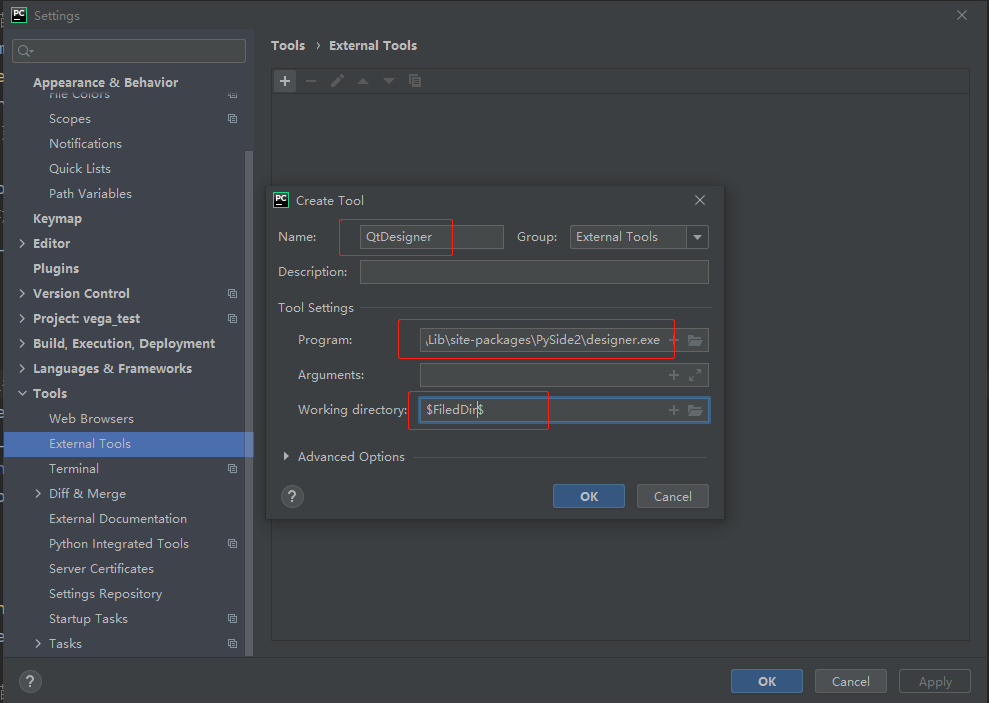
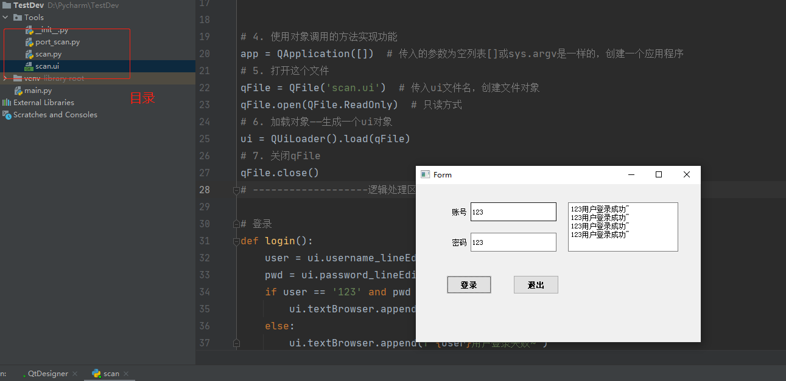
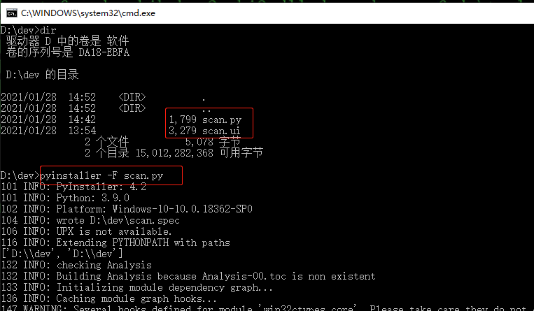
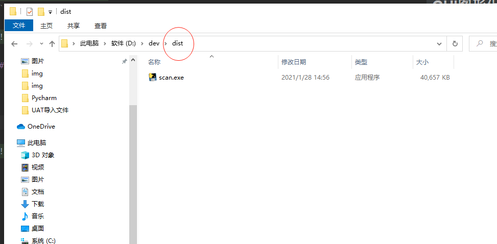

## GUI图形化用户接口
    软件提供给用户一个图形化界面
    用户只需要操作鼠标点击即可获得图形化的反馈，从而实现与软件的交互过程
    
### GUI编程
    通过某种编程语言，借助某个库，来编写图形化界面
    有多种语言可以实现以上操作，每一种语言也有多种库可以帮助我们快速实现GUI编程
    
### GUI（图形化）模块介绍
    1. Tkinter：是python最简单的图形化模块，总共有14种组件
    2. Pyqt：是python最复杂也是使用最广泛的图形化（不维护）,是GPLV3协议，使用了它，程序必须开源，否则违反协议
       PySide2是LGPL协议，如果只是作为库使用它，程序可以闭源商用
       不做商业项目，建议使用PyQt，资料多，稳定。需要开发闭源商用软件的就用PySide
       
       使用PySide设计GUI页面的时候，工具可以支持中文模式，功能与PyQt类似，足够满足日常测试开发需求
        
    3. Wx：是python当中居中的一个图形化，学习结构清晰
    4. Pywin：是python windows下的模块，摄像头控制（opencv）常用于外挂制作

### Qt Designer环境搭建
    cmd命令窗口输入命令安装:pip install PySide2 -i http://pypi.douban.com/simple/ --trusted-host pypi.douban.com
    
### Pycharm关联Designer

    1、Pycharm中打开：File->Settings->Tools->External Tools，打开页面
    目的：用于快速设计、修改 ui 并生成 .ui 文件
    
    2、弹窗中设置
        Program 设置：PySide2安装路径下的designer.exe路径
        Working directory 填写：项目路径 $FileDir$
        


### Pycharm关联PyUIC
    
    1、同样在路径：File->Settings->Tools->External Tools，打开页面
    目的：将GUI文件导出变成.py文件
    
    2、弹窗中设置
        Program设置：python的Scripts目录下的pyside2-uic.exe路径
        Arguments设置：$FileName$ -o $FileNameWithoutExtension$.py
        Working directory 填写：项目路径 $FileDir$
        
        
### 使用QtDesigner
    1. 先在Pycharm——Tools——External Tools——QtDesigner
    2. 在QtDesigner工具中设计好GUI图形界面保存成“.ui”文件
    3. 然后在Pycharm中选中“.ui”文件右键选择External Tools——PyUIC生成对应的“.py”文件
        注意：每次对应同一个“.ui”文件转换成“.py”文件都会覆盖前面的内容，所以要想保留可修改文件名后再转换
    
        
### QtDesigner工具
    学习参考文档：https://gitee.com/se7enXF/pyside2
    
    运行流程：
        1. 当我们想使用诸如按钮、文本框这种常见的组建时必须从PySide2.QtWidgets导入相应的模块
        2. 任何一个图形化的qt程序必须要创建QApplication的实例。Qt可以接受命令行参数，我们可以把命令行参数传递给
           QApplication的对象     
        3. 写完代码后这些图形就在计算机内存中了，为了让它出现在显示器上，我们需要调用show函数
        4. 使用exec()函数运行程序
        
        实例代码如下
        
```python
# -*- coding: utf-8 -*-

################################################################################
# Form generated from reading UI file 'scan.ui'
##
# Created by: Qt User Interface Compiler version 5.15.2
##
# WARNING! All changes made in this file will be lost when recompiling UI file!
################################################################################

# 1. 需要运行qt的gui程序，必须创建一个app对象
from PySide2.QtWidgets import QApplication
# 2. 需要先打开一个UI文件
from PySide2.QtCore import QFile
# 3. py代码需要加载ui文件(即设计的ui文件)
from PySide2.QtUiTools import QUiLoader


# 4. 使用对象调用的方法实现功能
app = QApplication([])  # 传入的参数为空列表[]或sys.argv是一样的，创建一个应用程序
# 5. 打开这个文件
qFile = QFile('scan.ui')  # 传入ui文件名，创建文件对象
qFile.open(QFile.ReadOnly)  # 只读方式
# 6. 加载对象——生成一个ui对象
ui = QUiLoader().load(qFile)
# 7. 关闭qFile
qFile.close()
# -------------------逻辑处理区域

# 登录
def login():
    user = ui.username_lineEdit.text()  # 数据从ui对象来
    pwd = ui.password_lineEdit.text()  # 数据从ui对象来
    if user == '123' and pwd == '123':
        ui.textBrowser.append(f'{user}用户登录成功~')
    else:
        ui.textBrowser.append(f'{user}用户登录失败~')

def quit():
    ui.textBrowser.clear()  # 清空数据
    ui.textBrowser.append('退出成功')

# 触发规则
# 点击登录，触发登录操作
ui.loginButton.clicked.connect(login)
# 点击退出，触发退出操作
ui.logoutButton.clicked.connect(quit)

# 接口下拉框处理工具
ui.comboBox.addItems(['GET', 'POST', 'PUT', 'DELETE'])

# --------------------
ui.show()  # 显示器显示
app.exec_()  # 运行程序
```



### 打包成exe步骤
    1. cmd命令窗口安装pyinstaller库：pip install -i http://pypi.douban.com/simple/ --trusted-host pypi.douban.com
    2. 将".py和.ui“文件复制放到文件夹中
    3. cmd命令窗口切换到保存上面文件的文件夹目录中输入命令：pyinstaller -F + 文件名 （-F 表示压缩打包，表示将环境库一起压缩成exe）
    4. 打包成功后，进入dist目录中找到“.exe”文件即可
    




### GUI实现接口工具
    注意：发送请求加载过程中，点击清除按钮，因为time和requests库是阻塞模式的，发送请求还没响应其它操作是无法实现的
    所以需要使用多线程，GUI窗口需要实现自适应放大缩小
    
    